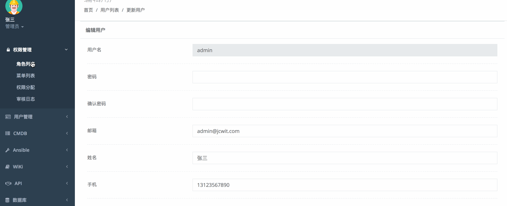
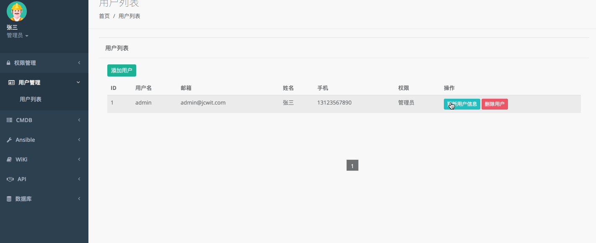
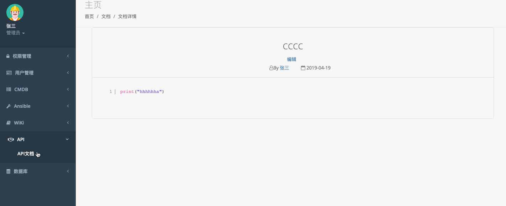
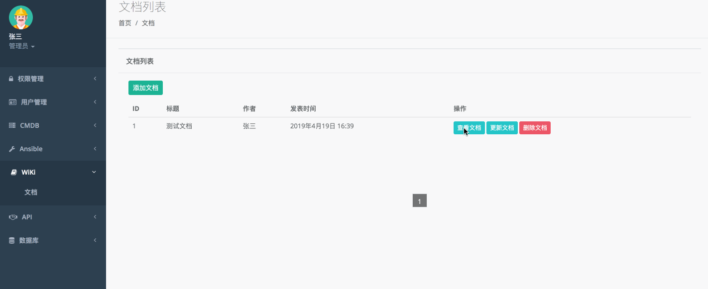
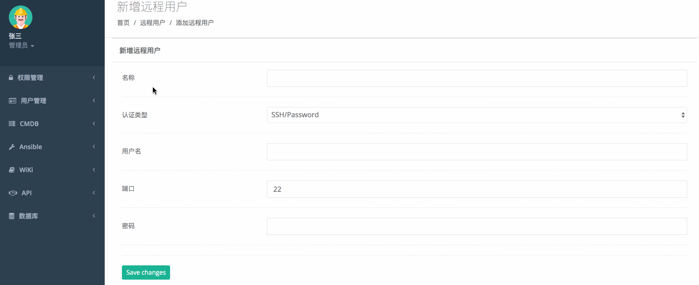
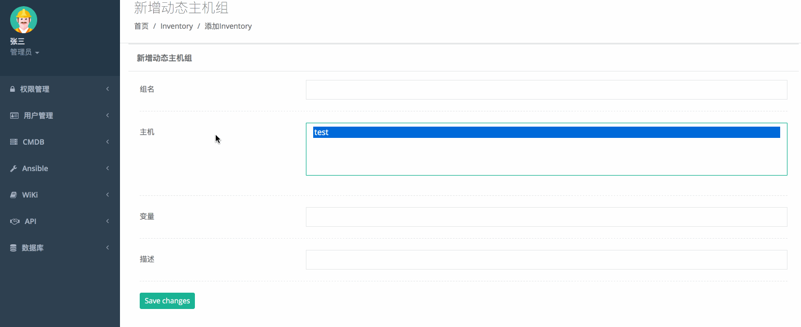

本系统基本django1.11.8+python3.5+centos7系统开发，目前实现的功能有rbac，cmbd，webssh，filemanage，ansible等功能

使用方法如下

## 下载代码

git clone  https://github.com/cc0411/opadmin

##  安装python包

pip  install  -r  requirements.txt

## 配置celery后台启动

cp conf/celeryd.conf /etc/default/celeryd

### 将配置文件里的内容按照实际情况更改

cp conf/celeryd.server /etc/init.d/celeryd

cp conf/celerybeat.server /etc/init.d/celerybeat

/etc/init.d/celeryd start  ##如果出现celeryd无法启动，则添加环境变量：export C_FORCE_ROOT="true"

/etc/init.d/celerybeat start
## 安装redis
## 安装mysql
## 初始化表
create database ops CHARACTER SET utf8 COLLATE utf8_general_ci;

python manage.py makemigrations

python manage.py migrate

python create_superuser
## 连接mysql
>mysql -u root -p；

>source db.sql；

## 运行
python manage.py runserver 0.0.0.0:8000

## 测试使用celery  相关命令
Celery -A opadmin  worker -l info

celery -A opadmin  beat -l info -S django  #监听后面定时任务

3. 启动flower celery -A opadmin  flower

http://localhost:5555/tasks web后台界面可以查看任务执行状态

## 具体功能实现图

1.登录页面，采用LDAP或腾讯企业微信认证，请先配置wx_config表相关配置

2.权限管理

3.用户管理

4.API

5.Wiki

6.CMDB

7.ansible

请大家给个stars，谢谢大家的关注

